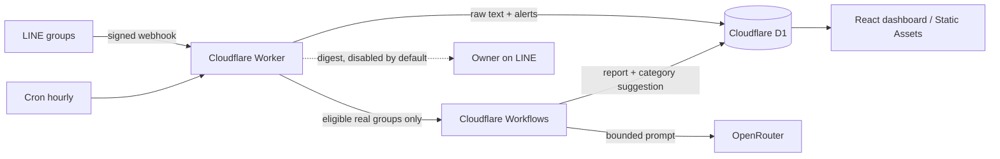

# เลขากลุ่ม LINE บน Cloudflare

ต้นแบบเลขาแบบเงียบสำหรับเจ้าของที่อยู่ในกลุ่ม LINE จำนวนมาก ระบบรับ webhook และเก็บข้อความไว้ชั่วคราว จัดหมวด สรุปสิ่งที่ต้องทำ แล้วรวมผลไว้ในเว็บ dashboard บน Cloudflare ทั้งหมด ไม่พึ่ง Vercel

## สิ่งที่ระบบทำ

- รับข้อความจากกลุ่มจริงได้สูงสุด 10 กลุ่ม และแยกจากข้อมูลจำลอง 100 กลุ่มอย่างชัดเจน
- บอทเงียบสนิท 100% — เข้ากลุ่มก็ไม่พูด ถูก add ก็ไม่พูด ไม่ตอบข้อความใดๆ ในกลุ่มเลย เจ้าของดูทุกอย่างผ่าน dashboard
- ตรวจคำเร่งด่วนแบบ deterministic ทันที โดยไม่เรียก AI ใน webhook
- ใช้ Cron Trigger ทุกชั่วโมง (`0 * * * *`) เพื่อเลือกเฉพาะกลุ่มจริงที่ถึงเงื่อนไขไปสรุปใน Workflow — dashboard จึงสดขึ้นทุกชั่วโมง ส่วนคำเร่งด่วนขึ้น alert ทันทีตั้งแต่ webhook ไม่ต้องรอรอบ
- ใช้ OpenRouter แบบมีเพดานจำนวน call และ input token ต่อวัน
- แสดง dashboard สองมุมมอง: “ต้องจัดการ” และ “ตามหมวด” โดยใช้ตัวกรองชุดเดียวกัน
- ให้เจ้าของแก้และล็อกหมวด พัก/เปิดกลุ่ม รับทราบ alert ลบข้อความดิบ และดู audit log ได้
- ช่องทางหลักของเจ้าของคือ dashboard (บอทเงียบถาวร) — ระบบ digest เข้า LINE มีอยู่แต่ปิดไว้ (`LINE_PUSH_ENABLED=false`) และแนะนำให้ปิดตลอด ถ้าจะเปิดภายหลังมีเพดาน 10 ครั้ง/วันทำงาน 280 ครั้ง/เดือน



## ขอบเขต Free tier ที่ออกแบบไว้

โครงสร้างนี้ใช้ Workers Free, Static Assets, D1 และ Workflows โดยปริมาณต้นแบบ 100 กลุ่มจำลอง + 10 กลุ่มจริงถูกออกแบบให้อยู่ต่ำกว่าโควตาหลัก ไม่ใช่คำรับประกันว่าจะฟรีหรือไม่สะดุดตลอดไป เพราะโควตาและเงื่อนไขของผู้ให้บริการเปลี่ยนได้ และ Free plan ไม่มี SLA แบบระบบเสียเงิน

ณ วันที่ 23 สิงหาคม 2026 เอกสาร Cloudflare ระบุ Workers Free ที่ 100,000 requests/วัน, CPU 10 ms ต่อ HTTP/Cron invocation และ 5 Cron Triggers ต่อบัญชี; D1 Free ที่ 5 ล้าน rows read/วัน, 100,000 rows written/วัน และ 5 GB รวม; Workflows Free ใช้ได้และรวม 3,000 steps/วัน กับ storage 1 GB-month. ถ้าเกินขีดจำกัด Free งานอาจถูกปฏิเสธจนกว่าโควตาจะ reset จึงควรดูหน้า “สถานะระบบ” และ Cloudflare Analytics เป็นประจำ

แหล่งอ้างอิง: [Workers pricing](https://developers.cloudflare.com/workers/platform/pricing/), [Workers limits](https://developers.cloudflare.com/workers/platform/limits/), [D1 pricing](https://developers.cloudflare.com/d1/platform/pricing/), [Workflows pricing](https://developers.cloudflare.com/workflows/reference/pricing/)

LINE OA แพ็กเกจฟรีในไทยให้ 300 ข้อความ/เดือน ปัจจุบันระบบกันไว้ที่ 280 automated pushes เพื่อเผื่อการส่งอื่น 20 ข้อความ และไม่เกิน 10 pushes/วันทำงาน ข้อความ Push นับตามจำนวนผู้รับ ส่วน Reply API ไม่ถูกนับ จึงส่ง digest หาเจ้าของคนเดียว ไม่ส่งกลับ 100 กลุ่ม ดูรายละเอียดจาก [LINE OA pricing](https://lineforbusiness.com/th/service/line-oa-features) และ [Messaging API pricing](https://developers.line.biz/en/docs/messaging-api/pricing/)

ค่า OpenRouter/โมเดล AI ไม่รวมใน Free infrastructure และขึ้นกับโมเดลที่ตั้งใน `OPENROUTER_MODEL` หากต้องการควบคุมเงินจริงควรกำหนดวงเงินที่บัญชี OpenRouter เพิ่มเติม เพดานในแอปเป็น safety guard ด้านจำนวน call/token ไม่ใช่ billing limit ของผู้ให้บริการ

## เริ่มในเครื่อง

ต้องมี Node.js 22+, npm และบัญชี Cloudflare สำหรับคำสั่ง remote

```bash
npm ci
cp .dev.vars.example .dev.vars
npm run db:migrate:local
npm run seed:demo:local
npm run dev
```

เปิด `http://localhost:5173` แล้วใช้รหัสที่กำหนดใน `.dev.vars` ไฟล์ `.dev.vars` ถูก ignore และห้าม commit

คำสั่งตรวจรับ:

```bash
npm test
npm run test:e2e
npm run typecheck
npm run build
npx wrangler deploy --dry-run
```

สำหรับ environment จริงให้ใช้ `npm run dry-run:preview`, `npm run deploy:preview` หรือ `npm run deploy:production` เท่านั้น Cloudflare Vite plugin เลือก environment ตอน build ไม่ใช่ตอน `wrangler deploy`; scripts เหล่านี้จึง build และตรวจ flattened config ก่อน deploy เพื่อป้องกันการผูก D1 ผิดชุด ดูรายละเอียดจาก [Cloudflare Environments](https://developers.cloudflare.com/workers/vite-plugin/reference/cloudflare-environments/)

ชุด E2E ใช้ `wrangler.e2e.jsonc` และ D1 local แยกต่างหาก มีค่า dummy และ `LINE_PUSH_ENABLED=false` จึงไม่อ่าน `.dev.vars` และไม่เรียก LINE/OpenRouter จริง

## โครงสร้างหลัก

- `worker/` — Worker API, LINE webhook, scheduler, Workflow และ D1 repositories
- `src/` — React owner dashboard ซึ่ง deploy เป็น Static Assets พร้อม Worker เดียวกัน
- `migrations/` — D1 schema และ migration
- `scripts/` — demo seed และเครื่องมือ configure/smoke deploy
- `test/` — Worker/UI tests
- `e2e/` — browser acceptance test

ขั้นตอนสร้าง Cloudflare environments, ตั้ง secrets และเชื่อม LINE อยู่ใน [INSTALL.md](./INSTALL.md)

## Safety defaults

- `LINE_PUSH_ENABLED=false` ใน local, E2E, preview และ production config
- demo groups ไม่เข้า LINE, AI, Cron selection หรือ Workflow
- webhook ตรวจ `x-line-signature` ก่อนบันทึกทุกครั้ง
- mutation ของ dashboard ต้องมี owner session และ same-origin request
- ไม่ log password, token, message body หรือ secret
- ข้อความดิบมี retention 30 วัน และลบเองได้จากหน้ารายละเอียดกลุ่ม

ก่อนเปิด production push ให้ตรวจ smoke test, URL digest, owner user ID และโควตา LINE จริง แล้วเปลี่ยนค่าใน commit ที่ review แยกต่างหาก
