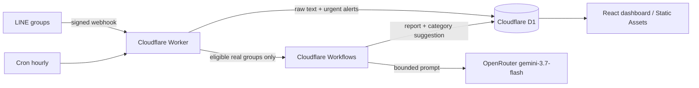

# เลขากลุ่ม LINE บน Cloudflare

เลขาเงียบสำหรับเจ้าของที่อยู่ในกลุ่ม LINE จำนวนมาก — บอทเข้าไปนั่งฟังในกลุ่ม เก็บข้อความ จัดหมวด สรุปสิ่งที่ต้องทำด้วย AI แล้วรวมทุกกลุ่มไว้ในเว็บ dashboard เดียว ทั้งระบบรันบน Cloudflare (Workers + D1 + Workflows + Static Assets) ไม่พึ่ง Vercel

## หลักการสำคัญ: บอทเงียบ 100%

- **เข้ากลุ่มไม่พูด ถูก add ไม่พูด ไม่ตอบข้อความใดๆ ในกลุ่มเลย** — ไม่มีแม้แต่ข้อความเปิดตัว
- ช่องทางเดียวของเจ้าของคือ **dashboard บน Cloudflare** (ล็อกอินด้วยรหัสผ่าน)
- ระบบ digest ส่งเข้า LINE มีโค้ดอยู่แต่**ปิดถาวร** (`LINE_PUSH_ENABLED=false` ทุก environment) และแนะนำให้ปิดตลอด

## สิ่งที่ระบบทำ

- รับข้อความจากกลุ่มจริงได้สูงสุด 10 กลุ่ม แยกขาดจากข้อมูลจำลอง 100 กลุ่ม (demo ไม่แตะ LINE/AI/Cron)
- ตรวจคำเร่งด่วนแบบ deterministic **ทันทีที่ข้อความเข้า** โดยไม่เรียก AI ใน webhook — เรื่องด่วนไม่ต้องรอรอบสรุป
- Cron **รายชั่วโมง** (`0 * * * *`) เลือกเฉพาะกลุ่มจริงที่ถึงเงื่อนไข (≥5 ข้อความ หรือรอเกิน 120 นาที หรือมี alert ด่วน) ไปสรุปใน Cloudflare Workflow → dashboard สดขึ้นทุกชั่วโมง
- สรุปด้วย OpenRouter (`google/gemini-3.7-flash`) ภายใต้เพดาน 120 call/วัน และ 500,000 input tokens/วัน จองโควตาแบบ atomic กันรั่ว
- บอทถูกเตะออกจากกลุ่มแล้วเชิญกลับ → กลับมาทำงานเองอัตโนมัติ (ถ้าโควตา 10 กลุ่มไม่เต็ม — เต็มจะขึ้น alert บอกเจ้าของ)
- Dashboard สองมุมมอง: "ต้องจัดการ" และ "ตามหมวด" ตัวกรองชุดเดียวกัน หน้าเว็บ poll เองทุก 60 วินาที
- เจ้าของแก้/ล็อกหมวด พัก-เปิดกลุ่ม รับทราบ alert ลบข้อความดิบรายกลุ่ม และดู audit log ได้



## ติดตั้งด้วย wizard (ทางแนะนำ)

```bash
bash scripts/wizard.sh check   # ตรวจ environment อย่างเดียว
bash scripts/wizard.sh         # เดินครบทุกขั้น (resume ได้ ข้ามขั้นที่ผ่านแล้ว)
```

wizard ตรวจเครื่องมือครบชุด (node ≥20.19 / npm / npx / git / openssl / curl บังคับ + python3 / gh / jq เสริม) แล้วทำแทนให้เกือบหมด: `npm ci` → login Cloudflare → สร้าง D1 preview/production → ผูก `database_id` → typecheck + test → migrate / seed / secrets / deploy / smoke ทั้งสอง environment → ตั้งและ verify LINE webhook ผ่าน API โดยไม่ต้องคลิกหน้าเว็บ

- **เบราว์เซอร์**: ทุกลิงก์ (Cloudflare OAuth, OpenRouter, LINE Console) จะพิมพ์ URL ออกมาให้เปิดใน Claude/Codex app browser — wizard บล็อก `open` ของระบบไว้
- **Secrets**: รับด้วย `read -s` แล้ว pipe ตรงเข้า `wrangler secret put` — ไม่ผ่าน argv, ไม่ลง shell history, token LINE ส่งเข้า curl ทาง stdin ไม่โผล่ใน process list
- สถานะอยู่ที่ `.generated/wizard-state` — `reset` เพื่อเริ่มใหม่, `selftest` ตรวจ logic ตัว wizard เอง

**บัญชี Cloudflare ใหม่**: deploy ครั้งแรก wrangler จะถามตั้งชื่อ workers.dev subdomain ของบัญชี (ครั้งเดียว ได้ URL ฟรีแบบเดียวกับ .vercel.app) — ถ้าติดแถบแดง "cannot register" ดูวิธีแก้ใน INSTALL.md ข้อ 0

ขั้นที่ต้องทำมือ (ไม่มี API): สร้าง LINE OA + Messaging API channel, เปิด "Allow bot to join group chats", เชิญบอทเข้ากลุ่ม — รายละเอียดใน [INSTALL.md](./INSTALL.md)

## ขอบเขต Free tier ที่ออกแบบไว้

โครงสร้างใช้ Workers Free, Static Assets, D1 และ Workflows โดยปริมาณ 100 กลุ่มจำลอง + 10 กลุ่มจริงออกแบบให้อยู่ต่ำกว่าโควตาหลัก — ไม่ใช่คำรับประกันว่าจะฟรีตลอดไป เพราะโควตาผู้ให้บริการเปลี่ยนได้และ Free plan ไม่มี SLA

ณ 23 สิงหาคม 2026: Workers Free 100,000 requests/วัน, CPU 10 ms ต่อ invocation, 5 Cron Triggers/บัญชี; D1 Free 5 ล้าน rows read/วัน, 100,000 rows written/วัน, 5 GB; Workflows Free 3,000 steps/วัน โค้ดถูกออกแบบรับข้อจำกัดพวกนี้ตรงๆ: วัดขนาด payload แบบ O(n), แตก SQL ที่ id เยอะเป็นก้อนละ ≤90 พารามิเตอร์ (D1 จำกัด 100/statement), จองโควตา AI ด้วย conditional SQL

อ้างอิง: [Workers pricing](https://developers.cloudflare.com/workers/platform/pricing/) · [Workers limits](https://developers.cloudflare.com/workers/platform/limits/) · [D1 pricing](https://developers.cloudflare.com/d1/platform/pricing/) · [Workflows pricing](https://developers.cloudflare.com/workflows/reference/pricing/)

**ค่า AI**: โมเดลตั้งใน `OPENROUTER_MODEL` (ปัจจุบัน `google/gemini-3.7-flash` — $0.375/M input, $1.875/M output) ที่เพดานเต็ม 500k tokens/วัน ≈ $6/เดือน ใช้จริง 10 กลุ่มมักอยู่หลัก ฿10–30/เดือน เพดานในแอปเป็น safety guard ไม่ใช่ billing limit — ควรตั้งวงเงินที่บัญชี OpenRouter ด้วย

## เริ่มในเครื่อง

ต้องมี Node.js 20.19+ (แนะนำ 22), npm และบัญชี Cloudflare สำหรับคำสั่ง remote

```bash
npm ci
cp .dev.vars.example .dev.vars
npm run db:migrate:local
npm run seed:demo:local
npm run dev
```

เปิด `http://localhost:5173` ล็อกอินด้วยรหัสใน `.dev.vars` (ต้องยาว ≥12 ตัวอักษร) — ไฟล์นี้ถูก ignore ห้าม commit

ตรวจรับ:

```bash
npm test            # worker 65 + UI 19
npm run test:e2e    # browser acceptance (D1 local, ไม่แตะ LINE/OpenRouter จริง)
npm run typecheck
```

## Deploy

ใช้เฉพาะ `npm run deploy:preview` / `npm run deploy:production` (หรือ `dry-run:*`) — Cloudflare Vite plugin เลือก environment ตอน **build** ไม่ใช่ตอน deploy สคริปต์เหล่านี้จึง build พร้อม `CLOUDFLARE_ENV` แล้วตรวจ flattened config (ชื่อ Worker, D1, Workflow, `LINE_PUSH_ENABLED`) ก่อนส่งขึ้นจริงทุกครั้ง กันผูก database ผิดชุด ([อ้างอิง](https://developers.cloudflare.com/workers/vite-plugin/reference/cloudflare-environments/))

## โครงสร้าง

- `worker/` — Hono API, LINE webhook (verify signature ก่อนเสมอ), scheduler, Workflow summarizer, D1 repositories
- `src/` — React dashboard (deploy เป็น Static Assets ใน Worker เดียวกัน)
- `migrations/` — D1 schema 8 ไฟล์
- `scripts/` — `wizard.sh` + configure/seed/smoke tools
- `test/`, `e2e/` — Vitest (workers pool + jsdom) และ Playwright
- `docs/superpowers/` — spec/plan ฉบับออกแบบเดิม (มีหมายเหตุกำกับจุดที่พฤติกรรมเปลี่ยนแล้ว)

## Safety defaults

- `LINE_PUSH_ENABLED=false` ทุก config — บอทไม่มีทางส่งอะไรออกไปเอง
- webhook ตรวจ `x-line-signature` (HMAC, constant-time compare) ก่อนบันทึกทุกครั้ง
- mutation ทุกตัวต้องมี owner session (cookie HttpOnly/Secure/SameSite=Strict) + same-origin
- login ผิด 5 ครั้ง/15 นาที → บล็อก 429 ทันทีที่ครั้งที่ 5 · เก็บ IP เป็น HMAC hash ไม่เก็บดิบ
- ไม่ log password, token, เนื้อหาข้อความ หรือ group id ดิบ (hash ก่อน)
- ข้อความดิบ retention 30 วัน ลบเองรายกลุ่มได้จาก dashboard · demo data ไม่ปนกลุ่มจริง
